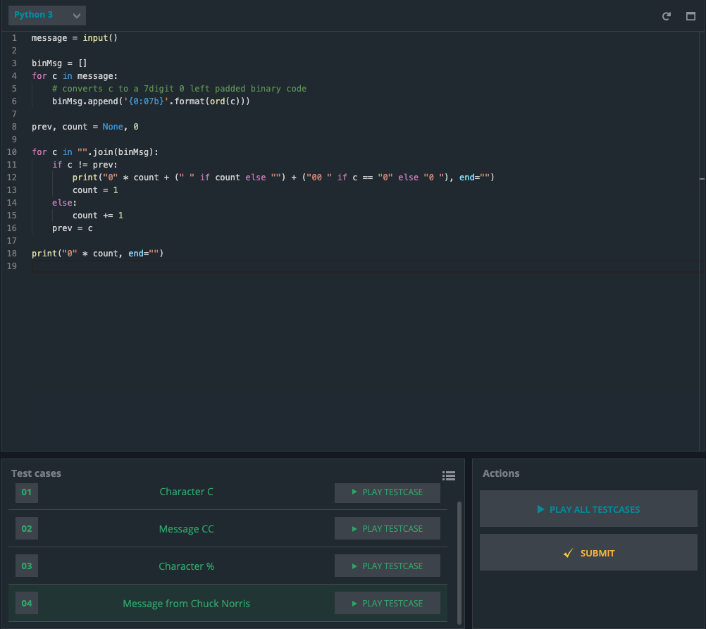

# Chuck Norris Codin challenge



### Code:
```.py
message = input()

binMsg = []
for c in message:
    # converts c to a 7digit 0 left padded binary code
    binMsg.append('{0:07b}'.format(ord(c)))

prev, count = None, 0

for c in "".join(binMsg):
    if c != prev:
        print("0" * count + (" " if count else "") + ("00 " if c == "0" else "0 "), end="")
        count = 1
    else:
        count += 1
    prev = c

print("0" * count, end="")
```
