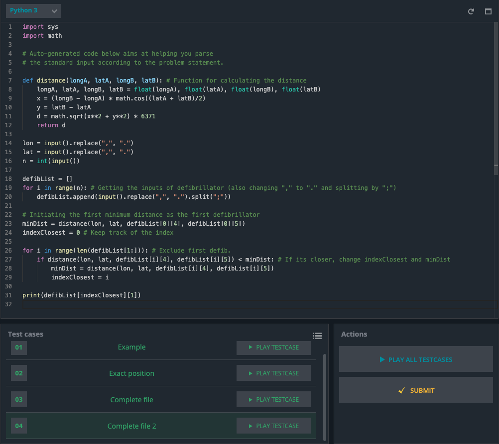

# Defibrillators



### Code:
```.py
import sys
import math

def distance(longA, latA, longB, latB): # Function for calculating the distance
    longA, latA, longB, latB = float(longA), float(latA), float(longB), float(latB)
    x = (longB - longA) * math.cos((latA + latB)/2)
    y = latB - latA
    d = math.sqrt(x**2 + y**2) * 6371
    return d

lon = input().replace(",", ".")
lat = input().replace(",", ".")
n = int(input())

defibList = []
for i in range(n): # Getting the inputs of defibrillator (also changing "," to "." and splitting by ";")
    defibList.append(input().replace(",", ".").split(";"))

# Initiating the first minimum distance as the first defibrillator
minDist = distance(lon, lat, defibList[0][4], defibList[0][5])
indexClosest = 0 # Keep track of the index

for i in range(len(defibList[1:])): # Exclude first defib.
    if distance(lon, lat, defibList[i][4], defibList[i][5]) < minDist: # If its closer, change indexClosest and minDist
        minDist = distance(lon, lat, defibList[i][4], defibList[i][5])
        indexClosest = i

print(defibList[indexClosest][1])

```
